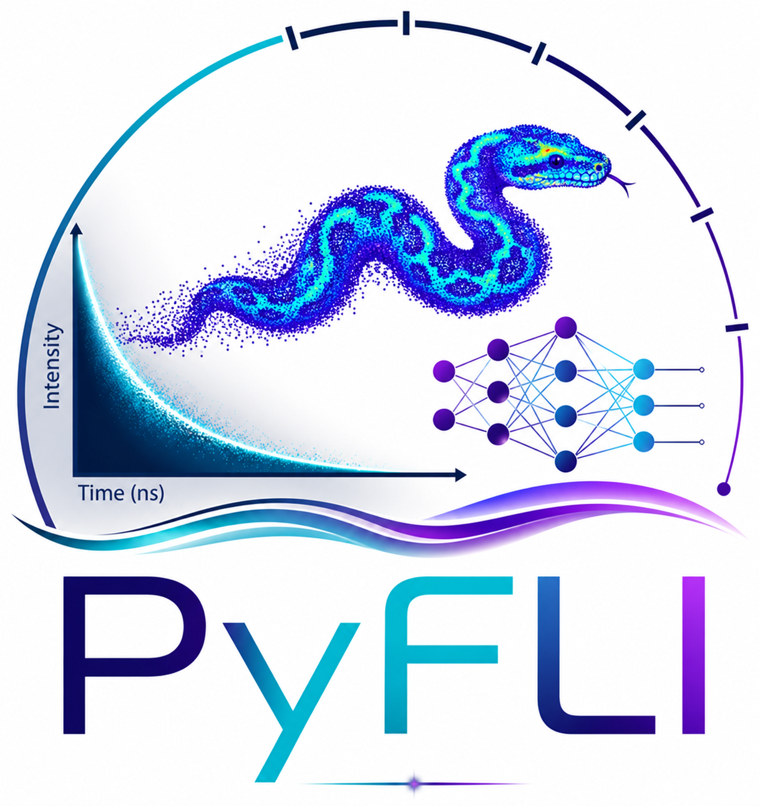

<p align="center">
  
</p>

# pyfli: A Unified Platform for FLI Data Processing

[](https://pyfli.org)
[](https://pypi.org/project/pyfli-lib/)
[](https://www.gnu.org/licenses/agpl-3.0)
[](https://www.python.org/downloads/)
[](https://github.com/vkp217/pyfli-pkg/actions/workflows/tests.yml)
[](https://github.com/vkp217/pyfli-pkg/issues)


`pyfli` is a comprehensive library designed for **Fluorescence Lifetime Imaging (FLI)** data simulation, data processing and benchmarking. It streamlines the workflow for handling diverse file formats from various hardware manufacturers and provides a standardized pipeline for both traditional analytical and deep-learning-based inference.

**Keywords:** Fluorescence Lifetime Imaging, FLIM, MFLI, FLI, FLI-data simulator, TCSPC, Phasor analysis, ICCD, SPAD, Laguerre deconvolution, non-linear least squares fitting (NLSF), maximum likelihood estimation (MLE), rapid lifetime determination (RLD), Bayesian inference (BayesFLI), compressed sensing (CS), hyperspectral imaging, benchmarking, bioimaging, microscopy, Python

---

## Key Features

* **Universal Processing Pipeline:** Simplifies the handling of multiple FLI file types (ICCD, SPAD, TCSPC).
* **Enhanced FLI Simulator:** A robust simulation engine adaptable to specific camera hardware parameters and noise models.
* **Standardized Inference:** Unified interface for time-resolved microscopy and macroscopic FLI data (MFLI).
* **Benchmarking:** Comparing traditional analytical methods and data processed in other software for benchmarking in place.
* **Compressed-Sensing Reconstruction:** Single-pixel hyperspectral FLI reconstruction from compressed measurements.

## Supported Data Acquisition Methods

The platform provides native support for several high-end imaging systems:

1. **ICCD:** Intensified Charge-Coupled Device cameras for fast-gated, wide-field imaging.
2. **SPAD:** High-speed SPAD (Single-Photon Avalanche Diode) architectures for high-resolution photon counting.
3. **TCSPC:** Standardized processing for Time-Correlated Single Photon Counting microscopy data.

## Data Processing & Analysis

`pyfli` implements industry-standard analytical methods to extract lifetime information:

* **Non-linear Least Squares Fitting (NLSF):** Robust mathematical approach for exponential decay modeling.
* **Phasor Plot Analysis:** Graphical, model-free transformation of fluorescence decay into a 2D polar plot for easy species separation.
* **Maximum Likelihood Estimation (MLE):** Statistical estimator optimized for low-photon regimes.
* **Rapid Lifetime Determination (RLD):** Computationally efficient method for real-time applications and high-frame-rate data.
* **Laguerre Method:** Model-free IRF deconvolution followed by multi-exponential lifetime extraction on a per-pixel basis.
* **Bayesian Inference:** Probabilistic parameter estimation with uncertainty quantification for lifetime fitting.

---

## Installation

Install the stable version directly from PyPI:

```bash
pip install pyfli-lib
```

For users requiring GPU-based processing, install the optional tensor/AI dependencies:

```bash
pip install "pyfli-lib[gpu]"
```

## Quick Start

Even though the package is installed as `pyfli-lib`, you import it as `pyfli` in your scripts:

```python
from pyfli import DataOperations

loader = DataOperations(
    data_path="experimental_data.sdt",
    irf_path="instrument_data.txt",
    bg_path="background_data.tif",
    mask_path="background_data.png",
)
decay_data = loader.load_data()
irf_data = loader.load_irf()
```

## Citation

If you use `pyfli` in your research, please cite this package:

> Pandey V., Erbas I., Barroso M., Radev S., Intes X. *PyFLI: A Python Library for Simulation, Parameter Estimation, and Benchmarking in Fluorescence Lifetime Imaging.*
> https://arxiv.org/abs/2609.11994

```bibtex
@misc{pandey2026pyflipythonlibrarysimulation,
      title={PyFLI: A Python Library for Simulation, Parameter Estimation, and Benchmarking in Fluorescence Lifetime Imaging},
      author={Vikas Pandey and Ismail Erbas and Margarida Barroso and Stefan Radev and Xavier Intes},
      year={2026},
      eprint={2609.11994},
      archivePrefix={arXiv},
      primaryClass={q-bio.QM},
      url={https://arxiv.org/abs/2609.11994},
}
```

---

## Repository & Issues

The source code is hosted on GitHub. Please report any bugs or feature requests via the issues tracker.
* **Website:** [https://pyfli.org](https://pyfli.org)
* **GitHub:** [https://github.com/vkp217/pyfli-pkg](https://github.com/vkp217/pyfli-pkg)
* **Contact:** For any queries, reach out at [pyfli4lifetime@gmail.com](mailto:pyfli4lifetime@gmail.com) or [support@pyfli.org](mailto:support@pyfli.org)
